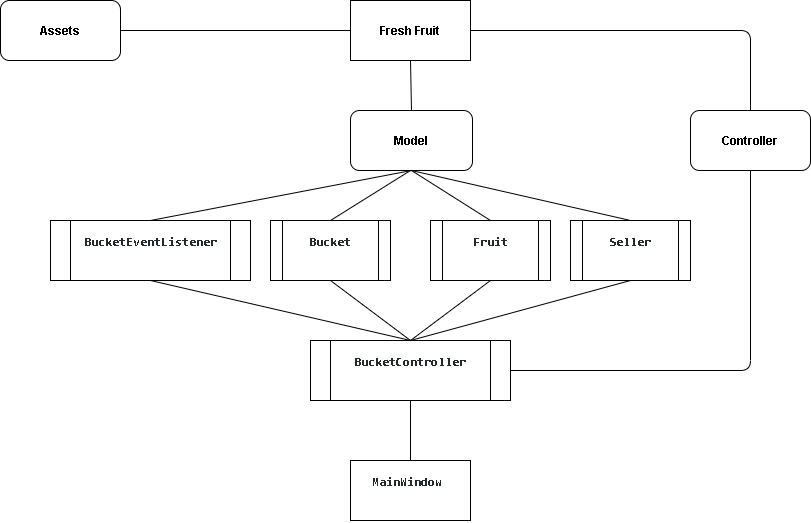

# Tugas

1. Apa fungsi BucketEventListener.cs ?

BucketEventListener berfungsi untuk mendeklarasi void onSucceed dan onFailed yang akan berguna di class lain.

2. Buatlah class diagram !

 

3. Berilah Pembahasan Alur atau logika pemrogramannya !

Jika saat menambahkan sesuatu berstatus onSucceed maka class yang ada di folder modul akan bekerja sesuai kodingan dan menuju ke class controler, setelah sampei di class controler maka data akan digabungkan dan diteruskan ke class MainWindow, jika sudah sampe maka data akan diproses lebih lanjut (menampilkan data, Dll).